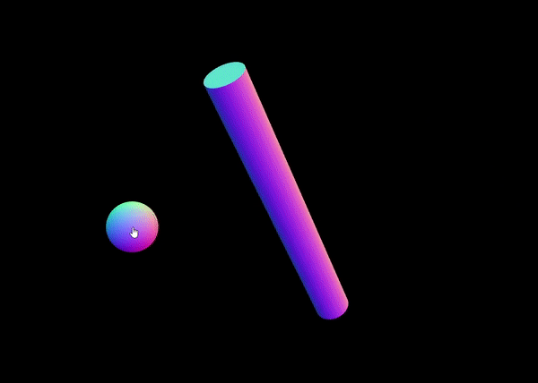

# Resn-Chime - Work in Progress
## Physics - Raycaster - Audio

 

     
    <a href="https://raw.githack.com/SimonsaysNL/Pinball-Dot-Matix-Display/main/backbox/index.html">View Demo</a>
    ·
    <a href="https://github.com/SimonsaysNL/Pinball-Dot-Matix-Display/issues">Report Bug</a>
    ·
    <a href="https://github.com/SimonsaysNL/Pinball-Dot-Matix-Display/issues">Request Feature</a>
  

<!-- TABLE OF CONTENTS -->

  
<h2 style="display: inline-block">Table of Contents</h2>

  <ol>
    <li>
      <a href="#about-the-project">About The Project</a>
      <ul>
        <li><a href="#built-with">Built With</a></li>
          <li><a href="#next-up">Next up</a></li>
      </ul>
    </li>
    <li><a href="#contact">Contact</a></li>
  </ol>

<!-- ABOUT THE PROJECT -->
## About The Project

Recreation of a demo on the Resn Website.
No revers engineering or inspecting of the original was done.

Content is for demo purposes.

### Built With

* [Threejs](https://threejs.org/)
* [GSAP](https://greensock.com/gsap/)
* [CANNONJS](https://github.com/schteppe/cannon.js)

### Next up

* Improving collision, wanted to emulate the original needs improvement

<!-- CONTACT -->
## Contact

Simon Kissing - [@realtimesimon](https://twitter.com/realtimesimon) - kissingsimon@gmail.com

Project Link: [https://github.com/SimonsaysNL/Pinball-Dot-Matix-Display/](https://github.com/SimonsaysNL/Resn-Chime/)
